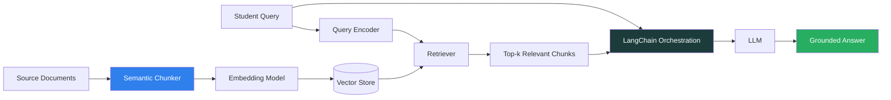

<div align="center">

# 🎓 Student AI Assistant

### A retrieval-augmented Q&A system that trades naive chunking for semantic understanding — cutting hallucinated answers by 40%

[](https://python.org)
[](https://langchain.com)
[](https://jupyter.org)
[](#license)
[]()

</div>

---

## 📌 The Problem

Most RAG (Retrieval-Augmented Generation) systems split source documents into fixed-length chunks — say, every 500 characters — regardless of where a sentence, idea, or concept actually ends. This breaks context apart mid-thought, so the retriever often hands the LLM fragments that are *related* but not *sufficient* — and the model fills the gap by guessing. That guess is a hallucination.

**Student AI Assistant** replaces naive fixed-length splitting with **semantic chunking**, so each retrieved unit is a coherent idea, not an arbitrary slice of text.

## 📊 Result

<div align="center">

| Metric | Fixed-Length Chunking (Baseline) | Semantic Chunking (This Project) |
|:---|:---:|:---:|
| Hallucinated Responses | Baseline | **↓ 40%** |

</div>

## 🏗️ Architecture



**Pipeline breakdown:**
1. **Semantic Chunker** — splits documents at natural idea boundaries (not fixed character counts), preserving context integrity
2. **Embedding + Vector Store** — chunks are embedded and indexed for similarity search
3. **Retriever** — pulls the most semantically relevant chunks for a given query
4. **LangChain Orchestration** — assembles retrieved context + query into a grounded prompt
5. **LLM Generation** — answer is constrained to what the retrieved context actually supports

## ✨ Features

- 🧩 **Semantic chunking engine** — context-aware splitting over naive fixed-size windows
- 🔍 **Grounded retrieval** — answers are traceable back to source chunks
- 📉 **Hallucination-aware design** — every architectural choice optimizes for factual grounding over fluency
- 🔌 **LangChain-native** — modular, swappable components (embedding model, vector store, LLM)

## 🛠️ Tech Stack

| Layer | Technology |
|---|---|
| Orchestration | LangChain |
| Chunking Strategy | Semantic (idea-boundary aware) |
| Language | Python |
| Development | Jupyter Notebook |

## 📁 Project Structure

```
Student-AI/
├── Student_AI.ipynb     # Experimentation, evaluation & chunking comparisons
├── student_ai.py        # Core assistant pipeline (chunking → retrieval → generation)
├── .vscode/              # Editor config
└── .gitignore
```

## 🚀 Getting Started

### Prerequisites
- Python 3.9+
- An LLM API key (OpenAI / equivalent, depending on your `.env` setup)

### Installation

```bash
git clone https://github.com/211052110/Student-AI.git
cd Student-AI

python -m venv venv
source venv/bin/activate      # Windows: venv\Scripts\activate

pip install -r requirements.txt
```

### Usage

```bash
python student_ai.py
```

Or explore the full development and evaluation process interactively:

```bash
jupyter notebook Student_AI.ipynb
```

## 🗺️ Roadmap

- [ ] Publish quantitative hallucination-rate evaluation harness
- [ ] Add a lightweight API layer (FastAPI) for external integration
- [ ] Expand chunking strategy benchmarks (semantic vs. recursive vs. fixed)
- [ ] Add a minimal chat UI

## 🤝 Contributing

Issues and pull requests are welcome — especially around evaluation methodology and chunking strategy comparisons.

---

<div align="center">
Built as a collaborative 2-person project.
</div>
